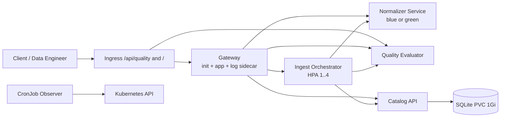

# QNET AI Data Quality Platform — CKAD Capstone

Capstone này triển khai một nền tảng chuẩn hóa và đánh giá chất lượng dữ liệu
trước khi dữ liệu được đưa vào AI/analytics. Hệ thống gồm đúng 5 bounded
microservices, mỗi service có source, Dockerfile, image và Deployment riêng.

Repository URL:
`https://github.com/letienmuoi/k8slab/tree/master/capstone-qnet-data-quality`

## 1. Business domain và user story

Một data engineer gửi một batch record thô. Platform phải:

1. Chuẩn hóa Unicode, case và whitespace.
2. Đo completeness, uniqueness, duplicate và quality score.
3. Lưu metadata lần ingest vào catalog bền vững.
4. Cho operator quan sát trạng thái bằng Kubernetes API và audit định kỳ.

Đây là logic nghiệp vụ thật, không phải các Pod chỉ `echo`/`sleep`.

## 2. Năm microservices

| Service | Trách nhiệm duy nhất | Image | Port | Data ownership |
|---|---|---|---:|---|
| `gateway` | Authentication và north-south API routing | `mualanhlung017/qnet-gateway` | 8080 | Stateless; runtime config/log ở `emptyDir` |
| `ingest` | Orchestrate một ingestion transaction | `mualanhlung017/qnet-ingest` | 8080 | Stateless |
| `normalizer` | NFKC, trim, collapse whitespace, casefold | `mualanhlung017/qnet-normalizer` | 8080 | Stateless |
| `quality` | Completeness/uniqueness/duplicate/score | `mualanhlung017/qnet-quality` | 8080 | Stateless |
| `catalog` | Dataset ingestion metadata | `mualanhlung017/qnet-catalog` | 8080 | SQLite trên PVC 1Gi |

Normalizer có hai release Deployment chạy đồng thời:

- blue: image `1.0.0`;
- green: image `1.1.0`, loại thêm Unicode format/control characters;
- Service `qnet-normalizer` flip `spec.selector.track` để chuyển traffic.

## 3. Architecture



Application calls are synchronous HTTP/JSON through Kubernetes DNS. Bounded
background work is modeled as Job/CronJob:

- `qnet-seed-dataset`: one-off business Job.
- `qnet-cluster-audit`: scheduled Job using least-privilege ServiceAccount.

Chi tiết boundaries và failure paths ở [docs/architecture.md](docs/architecture.md).

## 4. Repository layout

```text
capstone-qnet-data-quality/
|-- README.md
|-- docs/
|   |-- architecture.md
|   |-- api-contracts.md
|   |-- ckad-checklist.md
|   |-- demo-runbook.md
|   |-- proposal.md
|   `-- test-evidence.md
|-- services/
|   |-- gateway/
|   |-- ingest/
|   |-- normalizer/
|   |-- quality/
|   `-- catalog/
|-- k8s/
|   |-- base/
|   |-- overlays/dev/
|   |-- overlays/prod/
|   |-- platform/
|   |-- quota/
|   |-- security/
|   |-- storage/
|   |-- network/
|   |-- jobs/
|   `-- tests/
|-- helm/qnet-quality/
|-- scripts/
`-- tests/
```

## 5. Prerequisites

- Docker Desktop và Kubernetes local đang chạy.
- `kubectl` tương thích Kubernetes v1.35+.
- Helm v3+ hoặc v4.
- Ingress controller có class `nginx`.
- Metrics Server cung cấp `metrics.k8s.io`.
- CNI có NetworkPolicy enforcement.
- Một default StorageClass.

Kiểm tra:

```cmd
docker info
kubectl get nodes
kubectl get ingressclass
kubectl get apiservice v1beta1.metrics.k8s.io
kubectl get storageclass
helm version
```

Ingress controller và Metrics Server là cluster add-ons, đúng phạm vi đề bài và
không được chart/application tự chiếm quyền cluster-admin để cài.

## 6. Build images

Từ Windows `cmd`:

```cmd
cd /d C:\Users\franc\source\muoilt_k8slab\capstone-qnet-data-quality
scripts\build.bat all
```

Lệnh trên build `1.0.0` và `1.1.0` cho cả 5 services. Build một version:

```cmd
scripts\build.bat 1.0.0
```

Push tới Docker Hub sau `docker login`:

```cmd
scripts\build.bat all push
```

Linux/macOS:

```bash
./scripts/build.sh all
```

Không dùng tag `latest`.

## 7. Tạo Secret an toàn

Git chỉ chứa file [secret.env.example](secret.env.example) với value rỗng.
Sinh hai token ngẫu nhiên trong Windows `cmd`:

```cmd
for /f %T in ('powershell -NoProfile -Command "[guid]::NewGuid().ToString('N')"') do set CAPSTONE_API_TOKEN=%T
for /f %T in ('powershell -NoProfile -Command "[guid]::NewGuid().ToString('N')"') do set CAPSTONE_CATALOG_TOKEN=%T
```

Không chạy `echo %CAPSTONE_API_TOKEN%` khi trình bày. Deploy script tạo
`qnet-secrets` bằng client dry-run pipe; plaintext không được ghi ra file.

## 8. Deploy bằng Kustomize

Dev:

```cmd
scripts\deploy.bat dev
```

Prod overlay đổi các image stateless sang `1.1.0`, đặt gateway/ingest/quality
hai replicas và giữ catalog một replica do SQLite single-writer:

```cmd
scripts\deploy.bat prod
```

Render mà không đổi cluster:

```cmd
kubectl kustomize .\k8s\overlays\dev
kubectl kustomize .\k8s\overlays\prod
```

Apply thủ công:

```cmd
kubectl apply -f .\k8s\platform\namespace.yaml
kubectl apply -k .\k8s\quota
scripts\create-secret.bat
kubectl apply -k .\k8s\overlays\dev
```

## 9. Smoke test nghiệp vụ

```cmd
scripts\smoke-test.bat
```

Job thực hiện một E2E flow thật:

```text
gateway -> ingest -> normalizer -> quality -> catalog -> PVC
```

Expected log:

```text
"event": "smoke_test_passed"
```

Chạy one-off seed Job riêng:

```cmd
scripts\seed.bat
```

## 10. Ingress và Services

Ingress có hai Prefix rules:

```text
/api/quality -> qnet-quality:8080
/            -> qnet-gateway:8080
```

Kiểm tra:

```cmd
kubectl get ingress qnet-platform -n qnet-capstone
kubectl describe ingress qnet-platform -n qnet-capstone
kubectl get service,endpointslice -n qnet-capstone
```

Nếu cần truy cập gateway mà không phụ thuộc NodePort của controller:

```cmd
kubectl port-forward -n qnet-capstone service/qnet-gateway 18080:8080
```

Ở cửa sổ khác:

```cmd
curl http://localhost:18080/
curl -H "X-API-Token: %CAPSTONE_API_TOKEN%" http://localhost:18080/api/status
curl -X POST -H "Content-Type: application/json" -H "X-API-Token: %CAPSTONE_API_TOKEN%" -d "{\"dataset\":\"class-demo\",\"records\":[\"  QNET  DATA \" ,\"ＡＩ READY\",\"qnet data\",\"\"]}" http://localhost:18080/api/ingest
```

## 11. Rolling update và rollback

Script:

```cmd
scripts\rollout.bat update
scripts\rollout.bat status
scripts\rollout.bat rollback
```

Các lệnh CKAD tương đương:

```cmd
kubectl set image deployment/qnet-quality -n qnet-capstone quality=mualanhlung017/qnet-quality:1.1.0
kubectl rollout status deployment/qnet-quality -n qnet-capstone --timeout=180s
kubectl rollout history deployment/qnet-quality -n qnet-capstone
kubectl rollout undo deployment/qnet-quality -n qnet-capstone
```

## 12. Blue/green

```cmd
scripts\blue-green.bat green
scripts\seed.bat
scripts\blue-green.bat blue
```

Seed response field `pipeline.normalizer_version` đổi giữa `1.0.0` và `1.1.0`.
Hai Deployment không restart khi Service selector flip.

## 13. HPA

```cmd
kubectl get hpa qnet-ingest -n qnet-capstone
kubectl describe hpa qnet-ingest -n qnet-capstone
kubectl top pods -n qnet-capstone
```

Ingest requests `100m` CPU; target 50% tương đương trung bình khoảng `50m` mỗi
Pod. HPA có `min=1`, `max=4`.

## 14. ConfigMap, Secret và multi-container

```cmd
kubectl get configmap qnet-platform-config -n qnet-capstone -o yaml
kubectl describe secret qnet-secrets -n qnet-capstone
kubectl get pod -n qnet-capstone -l app.kubernetes.io/name=gateway -o jsonpath="{.items[0].spec.initContainers[*].name}{' | '}{.items[0].spec.containers[*].name}{'\n'}"
kubectl logs -n qnet-capstone deployment/qnet-gateway -c runtime-config
kubectl logs -n qnet-capstone deployment/qnet-gateway -c access-log-sidecar --tail=20
```

Init container biến ConfigMap endpoints thành `/work/runtime.json`. Main
container và init chia sẻ `emptyDir`; main và sidecar chia sẻ access log
`emptyDir`.

## 15. SecurityContext và RBAC

```cmd
kubectl get deployment qnet-catalog -n qnet-capstone -o jsonpath="{.spec.template.spec.securityContext}{'\n'}{.spec.template.spec.containers[0].securityContext}{'\n'}"
scripts\rbac-test.bat
```

Expected authorization:

```text
list pods    yes
list secrets no
```

Tất cả application containers chạy UID/GID 10001, drop `ALL`, cấm privilege
escalation, dùng `RuntimeDefault` seccomp và read-only root filesystem.

## 16. ResourceQuota và LimitRange

```cmd
kubectl get resourcequota,limitrange -n qnet-capstone
kubectl describe resourcequota qnet-project-quota -n qnet-capstone
kubectl describe limitrange qnet-container-limits -n qnet-capstone
```

Mọi container, kể cả init/sidecar/Job/CronJob, vẫn khai báo requests và limits
rõ ràng; LimitRange chỉ là admission safety net.

## 17. NetworkPolicy

Positive path được smoke Job chứng minh. Negative direct path:

```cmd
scripts\network-test.bat
```

Expected:

```text
"event":"network_policy_verified"
"blocked":true
```

Worker normalizer/quality chỉ được egress DNS. Catalog không có egress; response
traffic của connection được allow vẫn hoạt động.

## 18. PVC persistence

```cmd
scripts\pvc-test.bat
```

Script insert dữ liệu, ghi Pod UID và row count, xóa catalog Pod, đợi Deployment
tạo Pod mới rồi so sánh:

```text
old_uid != new_uid
old_record_count == new_record_count
```

## 19. Helm install, upgrade và rollback

Chart đóng gói riêng quality bounded context:

```cmd
scripts\helm-demo.bat run
```

Hoặc từng bước:

```cmd
scripts\helm-demo.bat lint
scripts\helm-demo.bat install
scripts\helm-demo.bat upgrade
scripts\helm-demo.bat rollback
scripts\helm-demo.bat history
```

Expected history: revision 1 stable → revision 2 canary → revision 3 rollback.

## 20. Probes và observability

Mọi long-running Deployment có liveness + readiness. Gateway có thêm startup
probe.

```cmd
kubectl get pods -n qnet-capstone
kubectl describe pod POD_NAME -n qnet-capstone
kubectl logs POD_NAME -n qnet-capstone -c CONTAINER_NAME
kubectl logs POD_NAME -n qnet-capstone -c CONTAINER_NAME --previous
kubectl get events -n qnet-capstone --sort-by=.metadata.creationTimestamp
kubectl top pods -n qnet-capstone
```

Logs là JSON stdout/stderr. Không có token plaintext trong log.

## 21. CKAD checklist

Mapping đầy đủ D1–D6, P1–P6, C1–C6, N1–N5 và O1–O5 nằm ở
[docs/ckad-checklist.md](docs/ckad-checklist.md).

Kết quả build và live validation đã thực hiện được ghi tại
[docs/test-evidence.md](docs/test-evidence.md).

Kiểm tra cluster state tổng hợp:

```cmd
scripts\verify.bat
```

## 22. Demo 5–10 phút

Dùng [docs/demo-runbook.md](docs/demo-runbook.md). Luồng ngắn:

```cmd
scripts\verify.bat
scripts\smoke-test.bat
scripts\blue-green.bat green
scripts\network-test.bat
scripts\pvc-test.bat
scripts\rbac-test.bat
scripts\helm-demo.bat run
```

## 23. Cleanup

```cmd
scripts\helm-demo.bat cleanup
scripts\cleanup.bat
```

`cleanup.bat` xóa namespace, do đó xóa cả PVC/data của Capstone. Nó không xóa
Ingress controller, Metrics Server hay workload ngoài `qnet-capstone`.

## 24. Known limitations

- Orchestration hiện là synchronous HTTP; production scale lớn nên thêm message
  bus/outbox nhưng không cần cho CKAD scope.
- SQLite phù hợp demo persistence và ownership; catalog giữ một replica với
  `Recreate`. Production nên dùng managed database hoặc database HA.
- Ingress chưa có TLS/domain thật.
- Tokens do operator tạo; repository không chứa secret management platform.
- Image được build local hoặc push thủ công, chưa có CI/CD pipeline.
- HPA cần Metrics Server và NetworkPolicy cần policy-capable CNI.
