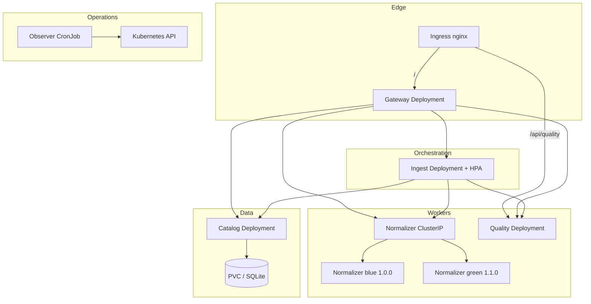
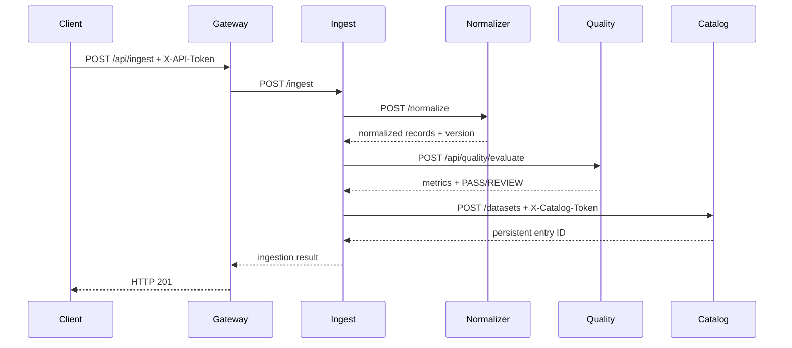

# Architecture and data flow

## Context

QNET AI Data Quality Platform prepares small datasets before AI/analytics use.
The system deliberately keeps five bounded contexts instead of combining all
logic into one Pod.

## Service boundaries

| Context | Owns | Does not own |
|---|---|---|
| Gateway | Public auth, route mapping, edge access log | Normalization, scoring, persistence |
| Ingest | Transaction orchestration and ingestion ID | Algorithms or data storage |
| Normalizer | Deterministic text normalization | Quality policy or dataset metadata |
| Quality | Quality metrics and pass/review decision | Mutation or persistence |
| Catalog | Durable ingestion metadata | Normalization/orchestration |

Updating one service only requires rebuilding that service image. Ingest calls
stable HTTP contracts and does not import source from the other services.

## Runtime topology



Only blue or green normalizer endpoints are selected at a time. Both releases
remain Ready, making rollback a Service selector patch.

## Business sequence



## Contracts and discovery

Clients use short Kubernetes DNS names in the same namespace:

```text
http://qnet-ingest:8080
http://qnet-normalizer:8080
http://qnet-quality:8080
http://qnet-catalog:8080
```

Ports are stable at 8080. Every Service uses named target port `http` to avoid
numeric drift between Service and Pod.

## Sync and async choices

- Ingestion is synchronous because the capstone returns normalized records and
  score to the caller in one bounded request of at most 500 records.
- Seed work is a finite Job because it must complete once.
- Cluster audit is a CronJob because it runs every five minutes.
- A production version with large datasets should use a message bus and outbox;
  that is intentionally outside CKAD scope.

## Data ownership and persistence

Only catalog mounts `qnet-catalog-data`. SQLite and its WAL files live under
`/data`. Other services are stateless and never mount this PVC. Catalog uses one
replica and `Recreate` to avoid two SQLite writers on a `ReadWriteOnce` volume.

## Gateway multi-container pattern

```text
runtime-config init
  reads ConfigMap env
  writes /work/runtime.json to emptyDir

gateway main
  reads /work/runtime.json
  writes JSON access log to /var/log/gateway/access.log

access-log-sidecar
  follows the shared log and emits it to stdout
```

The two `emptyDir` volumes have real purposes: immutable runtime assembly and
shared application logging.

## Trust and network zones

- Ingress controller may reach gateway and quality only.
- Gateway may reach ingest, normalizer, quality, and catalog.
- Ingest may reach normalizer, quality, and catalog.
- An `access-client` test/seed Pod may reach declared test paths.
- Other Pods cannot call backends directly.
- Normalizer and quality only have DNS egress.
- Catalog has no application egress.

Secret `public-api-token` protects north-south quality/ingest operations.
Secret `catalog-api-token` protects the persistence boundary. No token is
logged or stored in Git.

## Failure behavior

| Failure | Behavior | Evidence |
|---|---|---|
| Bad gateway config | Gateway readiness 503, Pod removed from endpoints | probe + Events |
| Normalizer unavailable | Ingest returns 502; no catalog row is written | ingest structured log |
| Quality rejects auth | Ingest reports downstream 401/502 | quality/ingest logs |
| Catalog unavailable | Ingestion fails before success response | PVC/Pod/Service events |
| Main process dead | Liveness restarts its container | restart count, `--previous` |
| Unauthorized east-west call | CNI timeout | network-deny Job |
